# آزمایش شماره ۴ - ایجاد و اجرای پردازه‌ها

- گروه شماره ۲۵
  - معین آعلی - ۴۰۱۱۰۵۵۶۱
  - ثمین اکبری - ۴۰۱۱۰۵۵۹۴

## مشاهده‌ی پردازه‌های سیستم و PID آن‌ها

ابتدا دستور زیر را وارد کرده و لیست پردازه‌ها را مشاهده می‌کنیم:

```bash
ps aux
```

نتیجه:

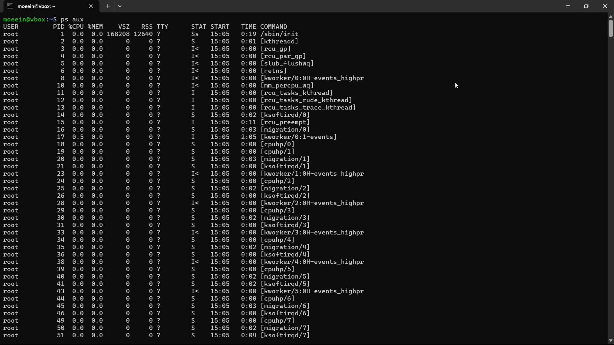

اولین پردازه به نام 
`init`
است. صفحه man آن به این صورت است:

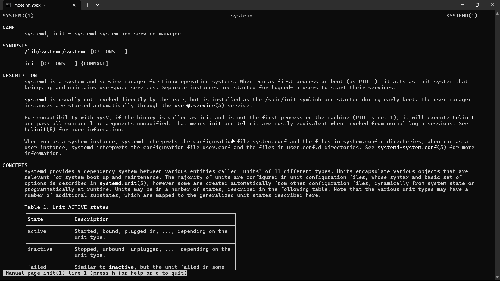

پردازه `init` اولین فرآیند کاربری است که پس از بارگذاری کرنل در سیستم‌عامل‌ لینوکس اجرا می‌شود و همیشه دارای `PID` برابر 1 است. وظیفه اصلی آن راه‌اندازی فضای کاربری (`userspace`) است، یعنی اجرای سرویس‌ها، mount کردن فایل‌سیستم‌ها، راه‌اندازی شبکه، مدیریت نشست کاربران و سایر فرآیندهای پایه‌ای سیستم. همچنین init به‌عنوان پدر تمام فرآیندهای یتیم نیز عمل می‌کند و در نهایت مسئول خاموش یا ریبوت کردن امن سیستم است.

حال به کمک تابع `getpid` در زبان C
یک برنامه‌ می‌نویسیم تا `PID` خودش را چاپ کند:

```C
#include <stdio.h>
#include <unistd.h>  

int main() {
    pid_t pid;

    pid = getpid(); 

    printf("PID: %d\n", pid);

    return 0;
}
```

خروجی این برنامه: 

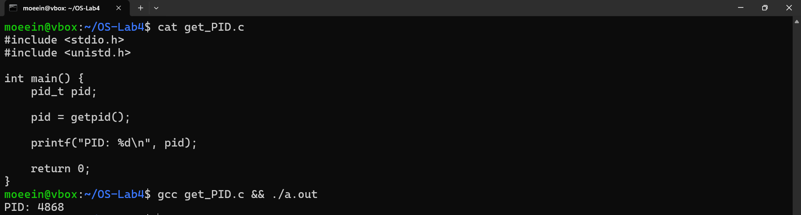

## ایجاد یک پردازه جدید

ابتدا به کمک تابع `getppid`
یک برنامه به زبان C می‌نویسیم تا شماره پردازه فعلی و پردازه مادر را چاپ کند:

```C
#include <stdio.h>
#include <unistd.h>  

int main() {
    pid_t pid = getpid(); 
    pid_t ppid = getppid();
    
    printf("PID: %d\n", pid);
    printf("PPID: %d\n", ppid);

    return 0;
}
```
خروجی:

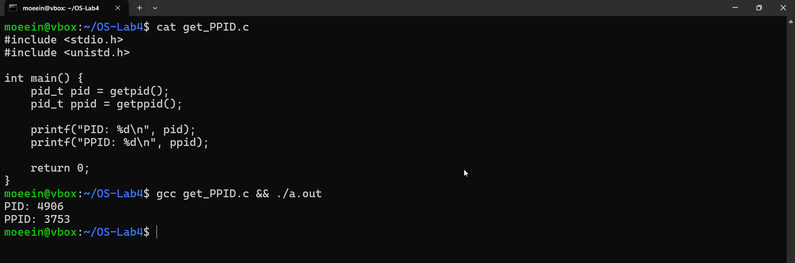

حال خروجی دستور 
`ps aux`
را به `grep`
می‌دهیم تا نام پردازه مادر را پیدا کنیم:

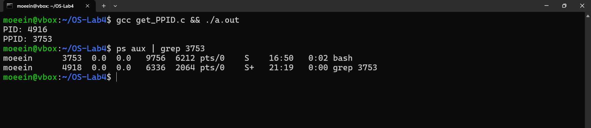

واضح است که پردازه والد مربوط به 
`bash`
است. زیرا ما از شل `bash`
استفاده کردیم و این شل پردازه مربوط به برنامه C را ایجاد کرده است.

ابتدا قطعه کد زیر را اجرا می‌کنیم:

```C
#include <stdio.h>
#include <sys/wait.h>
#include <unistd.h>

int main() {
    int ret = fork();

    if (ret == 0) {
        
        return 23; 
    } else {
        int rc = 0;
        wait(&rc); 
        printf("return code is %d\n", WEXITSTATUS(rc)); 
    }

    return 0;
}
```
خروجی:

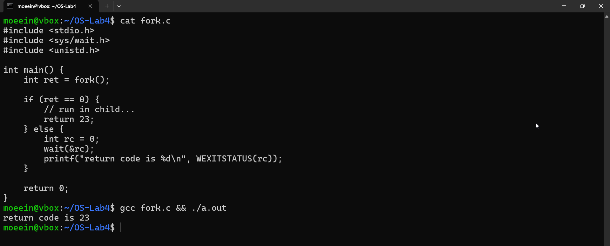

این کد با استفاده از تابع `fork` یک پردازه‌ی فرزند ایجاد می‌کند که کپی دقیقی از پردازه‌ی والد است. اگر `fork` در پردازه‌ی فرزند اجرا شود، مقدار ۰ بازمی‌گرداند و فرزند با مقدار بازگشتی ۲۳ از تابع main خارج می‌شود. در پردازه‌ی والد (که مقدار بازگشتی `fork` بزرگ‌تر از صفر است)، برنامه با استفاده از `wait` منتظر پایان پردازه‌ی فرزند می‌ماند و کد خروجی آن را دریافت می‌کند. سپس با استفاده از ماکرو `WEXITSTATUS`، کد خروجی فرزند استخراج و چاپ می‌شود. در نتیجه، این کد نشان می‌دهد که چگونه می‌توان یک پردازه‌ی فرزند را ایجاد کرد، منتظر اتمام آن بود، و مقدار بازگشتی آن را دریافت و چاپ کرد.

حال کد را به نحوی تغییر می‌دهیم که نشان دهد حافظه پردازه مادر و فرزند از هم متفاوت است:

```C
‍‍#include <stdio.h>
#include <sys/wait.h>
#include <unistd.h>

int main() {
    int x = 100; 
    int ret = fork();

    if (ret == 0) {
        x = 200; 
        printf("Child: x = %d\n", x);
        return 0;
    } else {
        wait(NULL);
        printf("Parent: x = %d\n", x);
    }

    return 0;
}
```

خروجی:

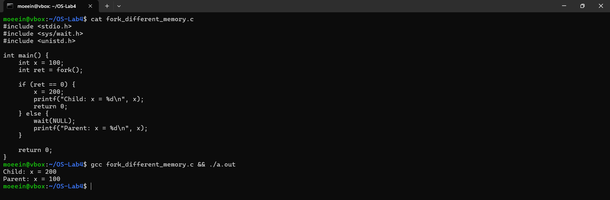


حال برنامه دیگری می‌نویسیم تا با توجه به خروجی تابع 
`fork`
در پردازه مادر و فرزند پیام‌های متفاوتی چاپ کند:


```C
#include <stdio.h>
#include <unistd.h>
#include <sys/wait.h>

int main() {
    int pid = fork();

    if (pid == 0) {
        printf("Child process...\n");
    } else if (pid > 0) {
        wait(NULL); 
        printf("Parent process...\n");
    } else {
        perror("fork failed :(");
    }

    return 0;
}
```

خروجی:

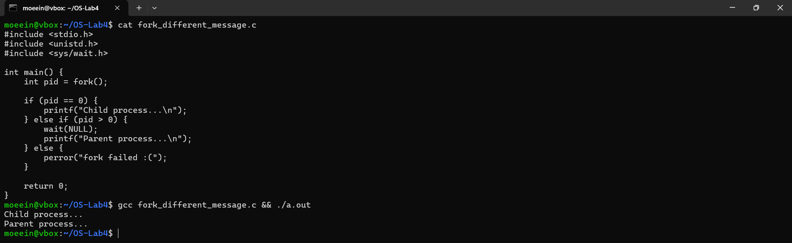


این بار دستور 
`fork`
را دو بار اجرا می‌کنیم:

```C
#include <stdio.h>
#include <unistd.h>
#include <sys/wait.h>

int main() {
    int ret1 = fork();
    printf("after first fork. PID: %d\n", getpid());

    int ret2 = fork();
    printf("after second fork. PID: %d\n", getpid());

    int ret3 = fork();
    printf("after third fork. PID: %d\n", getpid());

    if (ret1 == 0 && ret2 != 0 && ret3 != 0) {
        printf("I am child from first fork only\n");
    } else if (ret1 != 0 && ret2 == 0 && ret3 != 0) {
        printf("I am child from second fork only\n");
    } else if (ret1 != 0 && ret2 != 0 && ret3 == 0) {
        printf("I am child from third fork only\n");
    } else if (ret1 == 0 && ret2 == 0 && ret3 == 0) {
        printf("I am the grand-grand-child\n");
    } else if (ret1 > 0 && ret2 > 0 && ret3 > 0) {
        printf("I am the original parent\n");
        wait(NULL); wait(NULL); wait(NULL); 
    }

    return 0;
}
```

خروجی:

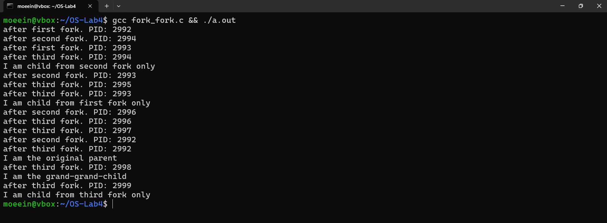

در این برنامه، سه بار `fork()` انجام شده که باعث ایجاد ۸ فرآیند می‌شود. هر `fork()`، فرآیند موجود را به دو قسمت تقسیم می‌کند، بنابراین پس از سه `fork()`، ۸ فرآیند فعال خواهیم داشت. در خروجی، هر فرآیند پیام‌هایی مانند after first/second/third fork را چاپ می‌کند که نشان می‌دهد در کدام مرحله از اجرای برنامه قرار دارد. سپس، بسته به مقادیر بازگشتی `fork()`‌ها، هر فرآیند نقش خود را تعیین و اعلام می‌کند (مثلاً "I am child from second fork only" یا "I am the original parent"). والد اصلی هم سه بار `wait()` منتظر پایان فرزندانش می‌ماند. ترتیب پیام‌ها ممکن است به خاطر اجرای هم‌زمان متفاوت باشد، اما در مجموع، برنامه ساختار درختی ایجادشده توسط `fork()`‌ ها را به‌خوبی نشان می‌دهد و نقش هر فرآیند را مشخص می‌کند.


## اتمام کار پردازه‌ها

در این بخش باید کدی بنویسیم تا یک پردازه فرزند ایجاد کند و سپس منتظر اتمام کار آن باشد و پس از پایان آن پیغامی را چاپ کند. برای این کار مشابه کدهای قبلی از 
`wait`
در پردازه والد اس‍تفاده می‌کنیم:

```C
#include <stdio.h>
#include <unistd.h>
#include <sys/wait.h>

int main() {
    pid_t pid = fork();

    if (pid < 0) {
        perror("Fork failed");
        return 1;
    }

    if (pid == 0) {
        for (int i = 1; i <= 10; i++) {
            printf("%d\n", i);
        }
        return 0;
    } else {
        wait(NULL);
        printf("Child process finished.\n");
    }

    return 0;
}
```

نتیجه‌ی اجرا:

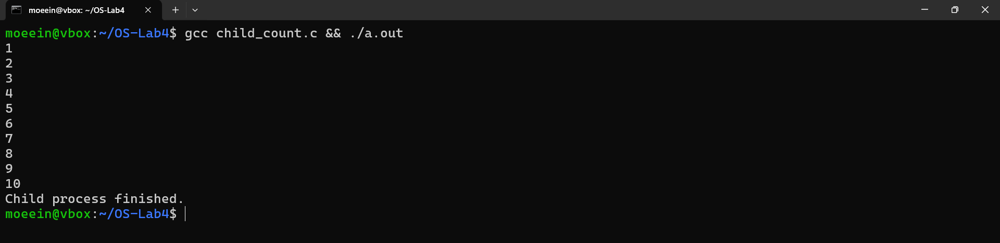

در صورتی که پیش از پایان کار پردازه فرزند، پردازه مادر کار خودش را تمام کند آن وقت والد پردازه فرزند به پردازه 
`init`
تغییر پیدا می‌کند. 
کدی می‌نویسیم تا این موضوع را بررسی کند. برای این کار از تابع 
`sleep`
در پردازه فرزند استفاده می‌کنیم:


```C
#include <stdio.h>
#include <unistd.h>
#include <sys/types.h>

int main() {
    pid_t pid = fork();

    if (pid < 0) {
        perror("Fork failed");
        return 1;
    }

    if (pid == 0) {
        printf("Child: %d, my parent is %d\n", getpid(), getppid());

        sleep(3);

        printf("Child: %d, my new parent is %d\n", getpid(), getppid());
    } else {
        printf("Parent: exiting...\n");
        return 0;
    }

    return 0;
}
```

نتیجه ی اجرا:

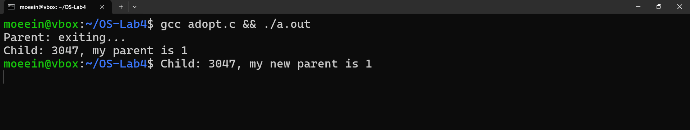

همانطور که مشخص است پردازه والد به پردازه `init`
تغییر پیدا کرده و `PID`
آن برابر با ۱ شده است.

## اجرای فایل

دستورهای خانواده `exec` برای جایگزینی کد اجرایی فعلی با یک برنامه‌ی دیگر استفاده می‌شوند. این‌ها معمولا در فرزندی که با `fork` ایجاد شده اجرا می‌شوند تا برنامه‌ای جدید را راه‌اندازی کنند.

- `execl(const char *path, const char *arg0, ..., NULL)`
    - آرگومان‌ها به صورت جدا جدا نوشته می‌شوند
    - مسیر کامل برنامه باید مشخص شود
    - با `NULL` پایان می‌گیرد
- `execv(const char *path, char *const argv[])`
  - مثل `execl` است، اما آرگومان‌ها را در قالب یک آرایه می‌گیرد
  - مسیر کامل نیاز دارد
- `execlp(const char *file, const char *arg0, ..., NULL)`
  - مثل `execl` است، اما `file` را در مسیرهای تعریف‌شده در `PATH` جستجو می‌کند
  - نیاز نیست مسیر کامل بدهی، فقط اسم برنامه کافی است
- `execvp(const char *file, char *const argv[])`
  - ترکیبی از `execv` و `execlp` است
  - مسیر را در `PATH` جستجو می‌کند
  - آرگومان‌ها را به صورت آرایه می‌گیرد


حال برنامه‌ای می‌نویسیم تا با استفاده از دستورات بالا در یک پردازه فرزند، دستور 
`ls -lg`
را اجرا کند:

```C
#include <stdio.h>
#include <unistd.h>
#include <sys/types.h>
#include <sys/wait.h>

int main() {
    pid_t pid = fork();

    if (pid < 0) {
        perror("Fork failed");
        return 1;
    }

    if (pid == 0) {
        char *args[] = {"ls", "-l", "-h", NULL};  

        execvp("ls", args);

        perror("execvp failed");
        return 1;
    } else {
        wait(NULL);
        printf("Child process finished\n");
    }

    return 0;
}
```

خروجی:

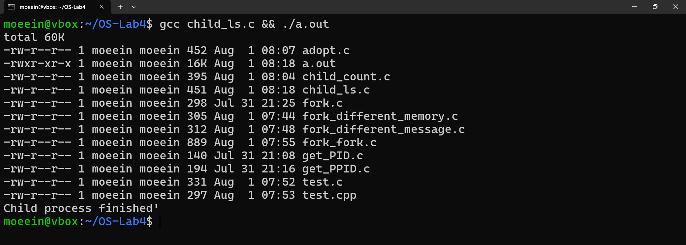


## فعالیت‌ها

### گروه‌های پردازه‌ای
گروه پردازه‌ای مجموعه‌ای از پردازه‌هاست که معمولاً با هم مرتبط‌اند (مثلا یک پردازه والد و فرزندانش) و به صورت تجمیعی فرایندها را مدیریت می‌کنند.
هر گروه پردازه‌ای یک شناسه به نام `PGID` دارد.

#### تابع `setpgid(pid, pgid)`

این تابع مشخص می‌کند که پردازه‌ای با شناسه `pid` باید به گروه پردازه‌ای با شناسه `pgid` تعلق داشته باشد.
اگر `pid == 0` باشد، یعنی پردازه‌ی جاری.
اگر `pgid == 0` باشد، پردازه خودش یک گروه جدید تشکیل می‌دهد.
معمولاً فرزندان از طریق والد، به گروه جدید اضافه یا جدا می‌شن.

کاربرد:
- کنترل گروهی پردازه‌ها (مثلاً مدیریت همه با یک سیگنال)
- اجرای jobهای پس‌زمینه و پیش‌زمینه در شل‌ها

#### تابع `getpgrp()`

شناسه گروه پردازه‌ی فعلی را برمی‌گرداند.

### درخت‌ پردازه‌ای

```C
#include <stdio.h>
#include <unistd.h>

int main () {
    fork ();
    fork ();
    printf ("Parent Process ID is %d\n", getppid ());
    return 0;
}
```

ابتدا کد را اجرا می‌کنیم:

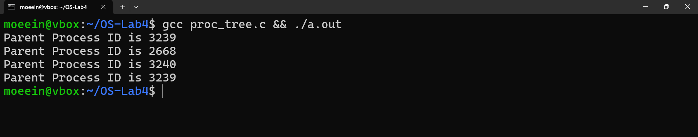

فرض کنیم `PID` اصلی برابر با P0 است،
ابتدا یک فرزند ایجاد می‌شود به نام P1.
حالا دو پردازه داریم به نام‌های P0‌ , P1 و حالا هر کدام مجدد 
`fork`
را اجرا می‌کنند و در نهایت ۴ پردازه داریم.

درخت پردازه‌ای ایجاد شده چیزی شبیه شکل زیر است:

```
P0
├── P1
│   └── P3
└── P2
```

### ترتیب تصادفی

```C
#include <stdio.h>
#include <unistd.h>

int main() {
    int i = 0, j = 0, pid, k, x;
    pid = fork();
    
    if (pid == 0) {
        // Child process
        for (i = 0; i < 20; i++) {
            for (k = 0; k < 10000; k++); // delay
            printf("Child %d\n", i);
        }
    } else {
        // Parent process
        for (j = 0; j < 20; j++) {
            for (x = 0; x < 10000; x++); // delay
            printf("Parent %d\n", j);
        }
    }
}
```
این برنامه با استفاده از `fork` یک فرآیند فرزند ایجاد می‌کند و سپس در هرکدام از والد و فرزند، به طور مستقل ۲۰ بار پیام‌هایی را چاپ می‌کند با یک حلقه تأخیری برای کند کردن چاپ‌ها.

این برنامه  مفهوم اجرای هم‌زمان در سیستم‌عامل را نشان می‌دهد.
به این صورت که هر کدام از آن‌ها به‌صورت موازی اجرا می‌شوند.
ترتیب اجرای `printf`‌ها در خروجی قابل پیش‌بینی نیست و ممکن است در هر اجرا متفاوت باشد.


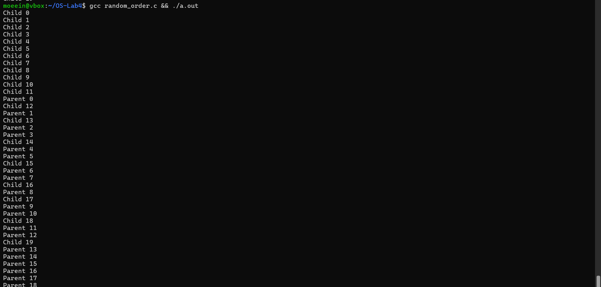

اگر کد را چند بار اجرا کنیم هر بار ترتیب متفاوتی مشاهده خواهیم کرد.

### پردازه زامبی

پردازه‌ی زامبی به پردازه‌ای گفته می‌شود که
اجرایش تمام شده (کدش به پایان رسیده)،
اما هنوز توسط والدش از سیستم خارج نشده (یعنی والد، وضعیت خروجی‌اش را با `wait` دریافت نکرده).

> پردازه زامبی یعنی جسم مرده‌ای که هنوز دفن نشده!

به عنوان مثال می‌توان کد زیر را اجرا کرد:

```C
#include <stdio.h>
#include <unistd.h>

int main() {
    pid_t pid = fork();
    if (pid == 0) {
        printf("Child finished.\n");
        return 0;
    } else {
        sleep(10);
        printf("Parent done.\n");
    }
    return 0;
}
```

پردازه فرزند تمام می‌شود اما والد کد خروجی آن را دریات نمی‌کند و خودش هم هم‌چنان زنده است.

نکته مهم:
- فقط والد می‌تونه زامبی رو پاک کنه
- اگر والد هم بمیره، زامبی توسط  پردازه`adopt` `init` می‌شه و پاک می‌شه

زامبی‌ها به خودی خود حافظه زیادی نمی‌گیرن، 
اما اگر زیاد بشن، جدول پردازه‌ها پر می‌شه و سیستم دیگه نمی‌تونه پردازه جدید بسازه و درنتیجه سیستم هنگ می‌کنه.